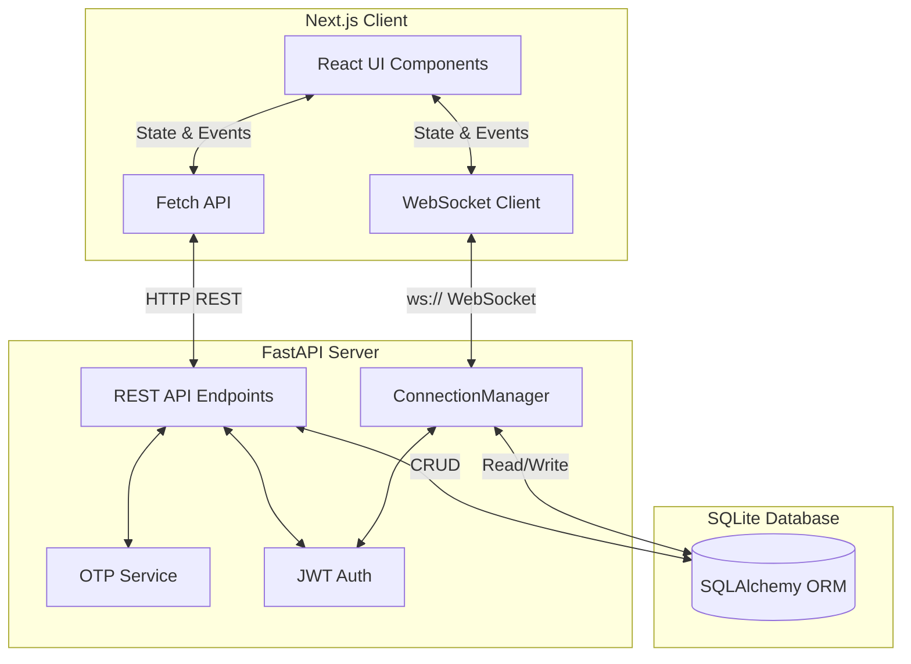

# Signal Clone

A real-time messaging application inspired by Signal, featuring a full-stack responsive web interface, real-time WebSocket communication, group chat management with robust permissions, and end-to-end receipt tracking (delivered, read).

## Tech Stack
- **Frontend**: Next.js (React), Tailwind CSS, Lucide Icons, WebSockets (native browser API).
- **Backend**: FastAPI (Python), SQLAlchemy (ORM), Uvicorn, WebSockets.
- **Database**: SQLite (via SQLAlchemy).

---

## Setup Instructions

### 1. Environment Variables
Create a `.env` file in the root `backend/` directory with the following variables:
```env
JWT_SECRET=your_super_secret_jwt_key
DATABASE_URL=sqlite:///./sql_app.db
```
Create a `.env.local` file in the root `frontend/` directory with:
```env
NEXT_PUBLIC_API_URL=http://localhost:8000
NEXT_PUBLIC_WS_URL=ws://localhost:8000
```

### 2. Backend Setup
Navigate to the `backend/` directory, create a virtual environment, and install dependencies:
```bash
cd backend
python -m venv venv

# On Windows:
venv\Scripts\activate
# On Mac/Linux:
source venv/bin/activate

pip install -r requirements.txt
```

### 3. Database & Seeding
To initialize the database with mock users and contacts, run the provided seed script from the `backend/` directory:
```bash
python seed.py
```

### 4. Running the Backend Server
Start the FastAPI server:
```bash
uvicorn app.main:app --reload --port 8000
```

### 5. Frontend Setup & Running
Navigate to the `frontend/` directory, install packages, and start the development server:
```bash
cd frontend
npm install
npm run dev
```
The frontend will be available at `http://localhost:3000`.

---

## Mocked OTP

> **Note**: Per assignment specifications, actual SMS/Email integrations are bypassed.

Every phone number's OTP code is hardcoded to **`123456`**.
When swapping in a real SMS provider (e.g., Twilio or AWS SNS) later, you only need to update the `backend/app/services/otp_service.py` file. Specifically, replace the internal logic of these two functions:
1. `generate_and_store_otp(db, phone, purpose)`: Replace the `code = "123456"` generation step with cryptographic randomness and fire off the SMS provider's API call.
2. *(Optional)* Add a rate-limiting integration if necessary, but the core verification logic in `verify_otp(db, phone, code, purpose)` already handles expiration and attempt counting.

---

## Architecture Diagram



---

## Database Schema & Relationships

- **Users**: Core user table containing phone, display name, avatar URL, and status.
- **Contacts**: Represents a one-way edge representing a saved contact (`owner_id` -> `contact_user_id`).
- **Conversations**: Chat threads. Contains `is_group`, `name`, `avatar_url`, `created_by_id`, and `disappears_after_seconds`.
- **ConversationParticipants**: Join table mapping `Users` to `Conversations`. Includes role (`creator`, `admin`, `member`), `is_active` (for leaving groups), `removed_by_id`, and timestamps.
- **Messages**: Individual messages. Links to a `sender_id` and a `conversation_id`. Supports `reply_to_id`, `message_type` (`text`, `system`, `image`), and `media_url`.
- **MessageReceipts**: Tracking mechanism for delivery statuses (`delivered_at`, `read_at`). A composite primary key mapping a `message_id` to a receiving `user_id`.
- **Reactions**: Maps a `user_id` to a `message_id` with an emoji payload.
- **OtpCode**: Tracks ephemeral login/registration OTPs, expiration times, and attempt limits.

---

## API Endpoint Reference

### Authentication (`/auth`)
- `POST /auth/request-otp`: Requests a login/registration OTP for a phone number.
- `POST /auth/verify-otp`: Validates the OTP and returns a JWT access token.
- `POST /auth/profile`: Completes user registration by setting a display name.
- `GET /auth/me`: Returns the currently authenticated user's profile.

### Contacts (`/contacts`)
- `GET /contacts/`: Returns a list of the user's saved contacts.
- `POST /contacts/`: Adds a new contact by phone number.

### Conversations (`/conversations`)
- `GET /conversations/`: Lists all active conversations for the user.
- `POST /conversations/direct`: Creates or fetches a 1-on-1 conversation with a user ID.
- `POST /conversations/group`: Creates a new group conversation.
- `GET /conversations/{id}/messages`: Fetches paginated message history.
- `GET /conversations/{id}/members`: Fetches participant metadata for a group.
- `POST /conversations/{id}/members`: Adds a member (Admin/Creator only).
- `PUT /conversations/{id}/members/{user_id}/role`: Updates a member's role (Admin/Creator only).
- `DELETE /conversations/{id}/members/{user_id}`: Removes a member or allows a user to leave.
- `POST /conversations/{id}/timer`: Updates disappearing message settings (Admin/Creator only).

### Media (`/media`)
- `POST /media/upload`: Handles multipart form data for images.

---

## WebSocket Event Reference

The frontend establishes a persistent connection to `ws://localhost:8000/ws?token=<jwt>`.

**Incoming (Server to Client):**
- `new_message`: A new text, image, or system message was sent.
- `message_delivered`: The recipient has received the message (double-tick).
- `message_read`: The recipient has read the message (blue double-tick).
- `typing`: Another user started/stopped typing.
- `reaction`: A user reacted to a message.
- `presence`: A contact went online/offline or updated their `last_seen`.
- `group_update`: Group metadata (timer, name) changed.
- `participant_update`: A member was added, removed, or their role changed.
- `error`: Failed operation (e.g., unauthorized action).

**Outgoing (Client to Server):**
- `send_message`: Dispatches a new message payload to a conversation.
- `typing`: Emits boolean typing state to conversation participants.
- `mark_read`: Acknowledges reading a specific message ID.
- `reaction`: Submits an emoji reaction to a message ID.

---

## Group Permission Matrix

The application implements a strict hierarchical permission system for group management.

| Action | Creator | Admin | Member | Left/Removed Member |
|---|---|---|---|---|
| **Send Messages** | ✅ | ✅ | ✅ | ❌ |
| **View Old Messages** | ✅ | ✅ | ✅ | ✅ |
| **Add Members** | ✅ | ✅ | ❌ | ❌ |
| **Remove Members** | ✅ | ✅* | ❌ | ❌ |
| **Promote/Demote Admin** | ✅ | ❌ | ❌ | ❌ |
| **Leave Group** | ✅ | ✅ | ✅ | - |
| **Change Disappearing Timer** | ✅ | ✅ | ❌ | ❌ |

*\*Admins can remove regular Members, but cannot remove the Creator or other Admins.*

---

## Assumptions & Limitations

1. **In-Memory WebSocket Manager**: The `ConnectionManager` stores active WebSockets in memory (a Python dictionary). This setup works perfectly for a single-instance backend but will **not scale horizontally** to multiple container replicas. In a production environment, this should be refactored to use Redis Pub/Sub so that WebSocket broadcasts can traverse multiple backend server instances.
2. **End-to-End Encryption (E2E)**: Per the scope of this project, E2E encryption is intentionally omitted. Messages are routed and stored in plaintext in the SQLite database to allow for straightforward auditing, grading, and debugging of delivery receipts.
3. **Media Storage**: Images are currently stored on the local disk (`backend/uploads/`). In production, `media.py` should be updated to stream uploads directly to an S3 bucket or equivalent object storage.
